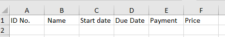

> ## Desktop - Electron Project 1
>
> -  This app is for monitoring the monthly payment collection to be used mainly by small businesses
> -  The user will input the Customer Name, Start Date, Due Date, Cost per Service
> -  The Due Date will change to red color if it has lapsed and not yet paid and the user can change this to green once payment has been made
> -  Every first day of the month, the app will reset all customers who have paid (color from green to no color); all customer who have not paid will remain red
> -  You can clone or downlaod this project.

---

> ### Electron + Vite + React + Typescript + Tailwindcss
>
> #### with xlsx file as data storage

---

> ### Guide to Download and Installtion
>
> > 1. download or Clone
> > 2. You need Nodejs v16.18
> > 3. to install the project run cli: npm -i or npm install
> > 4. to build the project run cli: npm run build
> > 5. To test the project run cli : npm run start (to test)
> > 6. To pack and deploy the project in window run cli: npm run pack
> > 7. Create Excel file with the following sample data as per sample pixcture below at sheet1
> >    
> > 8. Save the Excell in xlsx file extention
> > 9. Move the Book1.xlsx to folder disk
> > 10. Locate the Monthly Payment Monitoring.exe and double click to run the program.
> >
> > -

---

> ### Sample Screen Shot:
>
> > #### Main Screen
> >
> > 
> >
> > ### Update Customer Payment Status
> >
> > 
> >
> > #### ADD Customer Data
> >
> > 
> >
> > ### Delete Customer Data
> >
> > 
> >
> > ### Update Customer Data
> >
> > 
