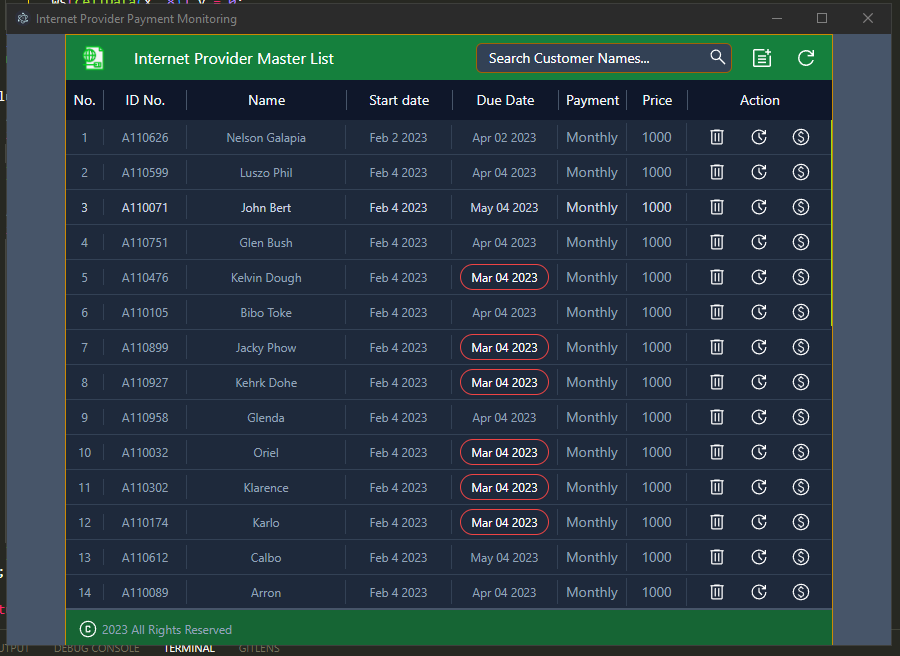
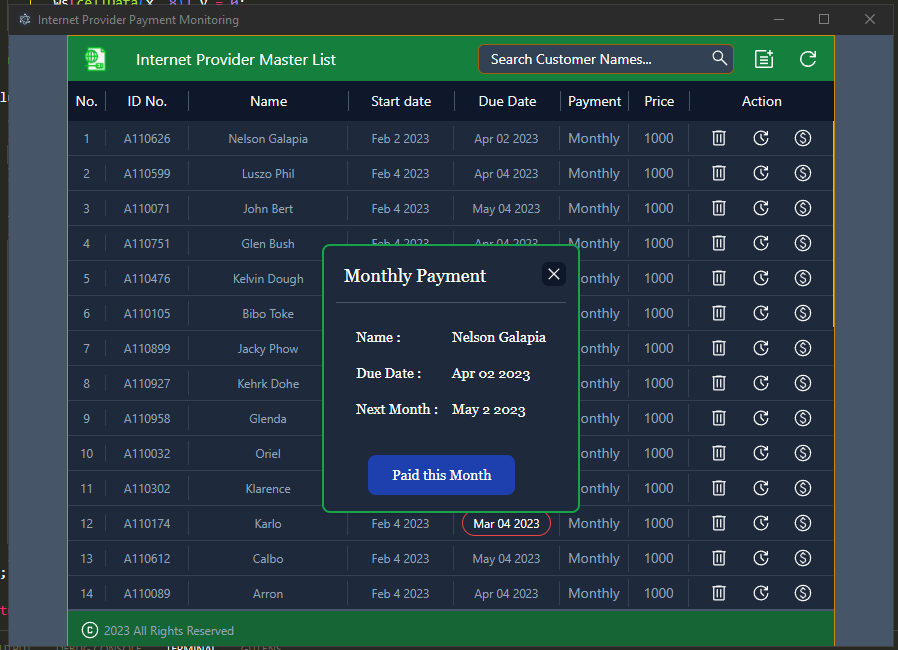
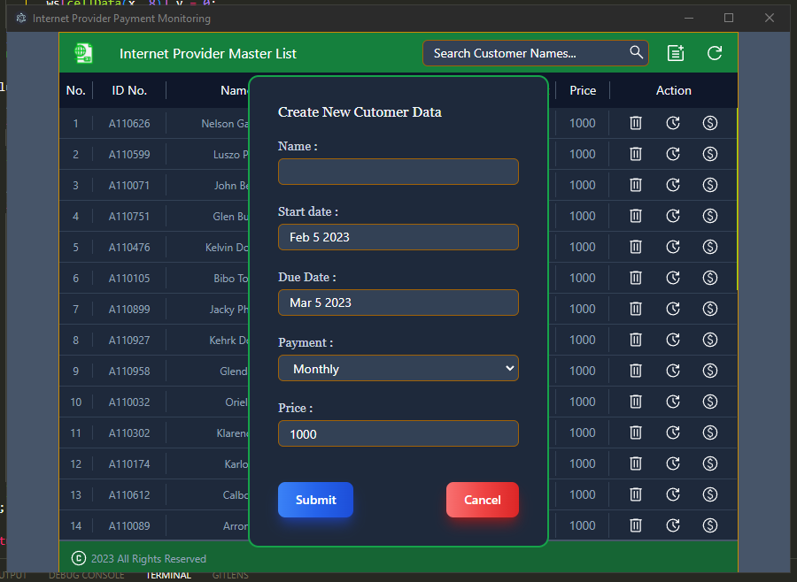
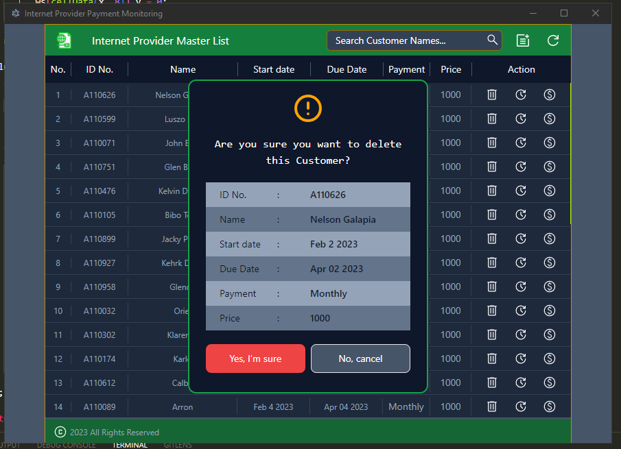
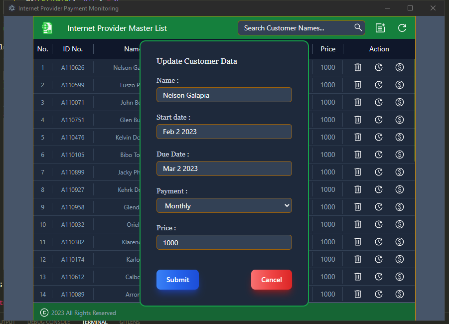

> ## Desktop - Electron Project 1
>
> -  This app is for Small business Monthly Payment Monitoring Collection.
> -  Create Customer Name, Date of Start ,Due Date and price of Service.
> -  Then after one month the due date data will change red color and you can change to green as paid.
> -  Every first day of the month will reset all paid customer and activate to monitor.
> -  You can clone or downlaod this project.

---

> ### Electron + Vite + React + Typescript + Tailwindcss
>
> #### with xlsx file as data storage

---

> ### Guide to Download and Installtion
>
> > 1. download or Clone
> > 2. Nodejs v16.18
> > 3. npm -i or npm install
> > 4. npm run build
> > 5. npm run start (to test)
> > 6. npm run pack ( to package the project )
> > 7. find dis
> >
> > -

---

> ### Sample Screen Shot:
>
> > #### Main Screen
> >
> > 
> >
> > ### Update Customer Payment Status
> >
> > 
> >
> > #### ADD Customer Data
> >
> > 
> >
> > ### Delete Customer Data
> >
> > 
> >
> > ### Update Customer Data
> >
> > 
